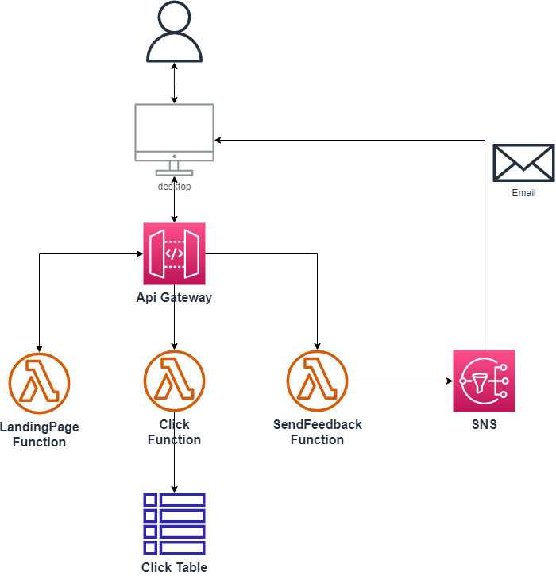

# Building a simple serverless app with AWS SAM

This is a very simple tutorial to learn how to build a very simple web application wit SAM (Serverless Application Model)

## Application architecture



## Tutorial overview

- First we create a function that will return a landing page (API Gateway + Lambda) 
- Second we create a function that will record clicks in a table (API Gateway + Lambda + DynamoDB)
- Third we create a function that will record feedback in a table and send a confirmation email (API Gateway + Lambda + DynamoDB + SNS)

## Setup

* Connect to your AWS account. 
    * If you do not have one, create it at [aws.amazon.com/free](aws.amazon.com/free) - you will benefit from a free tier for 12 months
* Create a Cloud9 environment 
    * Open Cloud9 Service
    * Click on 'Create Environment'
        * Name: serverless-app-tutorial
        * Click on 'Create'
        * Click on 'Open' (Wait for about one minute)
        * Close welcome page and Immediate Tab
        * Delete Readme.txt file (.c9 should then disappear)
        
* Clone this repository
    * Go to Cloud9 terminal
    * execute: ```git clone https://github.com/welcloud-io/wio-tutorial-serverless-app-with-sam.git```

## Tutorial steps

##### Prepare for deployment
* Unfold 'wio-tutorial-serverless-app-with-sam' in cloud9 folder tree
* Open '_deploy.sh' file
* Click on 'Run'
* You should see a new tab (deployment tab) opening, with an error message 
starting with *Missing 'Folder' Parameter*, which is normal

### *sam-app-00*

##### Deploy "hello" landing page
* Unfold 'wio-tutorial-serverless-app-with-sam/sam-app-00'
* Open and explore 'template.sam.yaml'
* Open and explore 'landing-page-function/landing_page_function.py'
* Add 'sam-app-00' at the end of the Command field of the deployment tab
* Click 'Run' button (top left of the deployment tab)
* You should see the app deploying with messages deployment tab
* When finished open a new AWS Console (from Cloud9 menu bar => 'AWS Cloud9' / 'Go to your dashboard')
* Open CloudFormation service & Explore simple-sam-app stack

##### Test the "hello" landing page
* Go to Api Gateway Service in the AWS console
* Click on 'simple-sam-app' in the list
* Click on the invoke url starting with 'https://...'
* You should see your landing page displaying 'hello'

##### Explore the lambda function in the console
* Go to Lambda Service in the AWS console
* Click on simple-sam-app... function
* Explore lambda function page

##### View the relationship between api endpoint and lambda function
* Go to Api Gateway Service in the AWS console
* Click on 'simple-sam-app' in the list
* Click on 'integrations' on the left
* Click on the 'GET' route
* You should see the relationship between the api endpoint and the lambda

### *sam-app-02*

##### Explore the new landing-page-function containing a click button
* Open landing_page_function.py in 'sam-app-02/landing-page-function' folder
* Verify it now returns an http response with index.hmtl content
* Open index.html 'sam-app-02/landing-page-function' folder
* Verify it contains html with a click button 

##### Redeploy sam-app with a button you can click on
* Replace 'sam-app-01' with 'sam-app-02' in the command field of the deployment tab
* Click the 'Run' button at the top left of the deployment tab
* You should see the app deploying with messages in the tab (updating the previous stack) 
* When fnished refresh the page containing the landing page (or click again on the api link in api gateway)
* You should see a click button on the landing page

### *sam-app-04*

##### Explore the landing-page-function
* Open landing_page_function.py in 'sam-app-04/landing-page-function' folder
* Verify it still return an http response with index.hmtl content
* Open index.html 'sam-app-04/landing-page-function' folder
* Verify that each time you'll click you will post a query to a '/click' route of your api endpoint

##### Explore the click-function  
* Open click_function.py in 'sam-app-04/click-function' folder
* Verify that each time this function is executed, it will update a dynamodb table item

##### Explore the sam template and deploy
* Open 'template.sam.yaml' in 'sam-app-04' folder
* Verify the new Click function is decribed with the appropriate route '/click'
* Verify that the templates will create a dynamodb table
* Replace 'sam-app-02' with 'sam-app-04' in the command field of the deployment tab

##### Test that the number of clicks is persisted into the table
* When deployment is finished, refresh the page containing the landing page (or click again on the api link in api gateway)
* Hit F12 in your web browser to open the developer tools, select network tab to see api calls
* Click on the [CLICK] button of the landing page, you should see the api calls in developer tools returning 200 (success)
* Go to the aws console
* Go to the dynamodb service
* Click on the simple-sam-app-ClickTable-... Table
* Click on 'Explore table Items'
* Verify the item containing the number of clicks is there
* Click on the [CLICK] button of the landing page
* Verify the table is updated

### *sam-app-06*

#### Explore the new landing-page-function
* Open index.html in 'sam-app-06/landing-page-function' folder 
* Verify we now use a /send-feedback route with a feedback content
* Verify the page contains a feedback field and a send button

#### Explore the send-feedback-function
* Open send_feedback_function.py files in 'sam-app-06/send-feedback-function' folder 
* Verify the function will persist a feedback and send it to an sns topic (associated with an email)

#### Explore the sam template and deploy
* Open 'template.sam.yaml' in 'sam-app-06' folder
* Verify we create a table and an sns topic
* IMPORTANT: under Subscription, replace Endpoint value with your Email
* Replace 'sam-app-04' with 'sam-app-06' to in the Command field of the _deploy.sh tab that was opened previously

##### Test you receive a feedback from the app
* When deployment is finished, refresh the page containing the landing page (or click again on the api link in api gateway)
* IMPORTANT: Go to your mailbox and confirm the subscription you received from SNS (click the link in the email)
* Fill in the form in the landing and click on [SEND]
* Check the feed back is recorded in the simple-sam-app-FeedbackTable-.. dynamodb table
* Check that the user receive a confirmation of it's feedback

## Clean things up
* Go to Cloudformation service
* Select 'simple-sam-app', click [Delete] and [Delete] Again
* Go to cloud9 service 
* Select 'serverless-app-tutorial', click [Delete] and type Delete