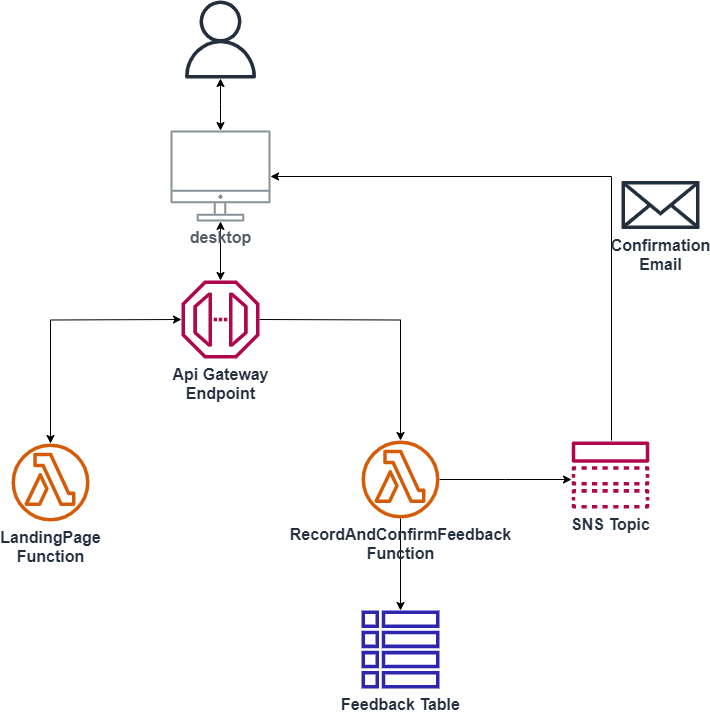

# Building a simple serverless app with AWS SAM

This is a very simple tutorial to learn how to build a very simple web application wit SAM (Serverless Application Model)

#### Application architecture

#### Tutorial overview

- First we create the landing page (API Gateway + Lambda) 
- Second we create the click counter (API Gateway + Lambda + DynamoDB)
- Third we create the feedback feature ((API Gateway + Lambda + SNS)

#### Setup:

* Connect to your AWS account
* Create a Cloud9 environment
* Clone this repository